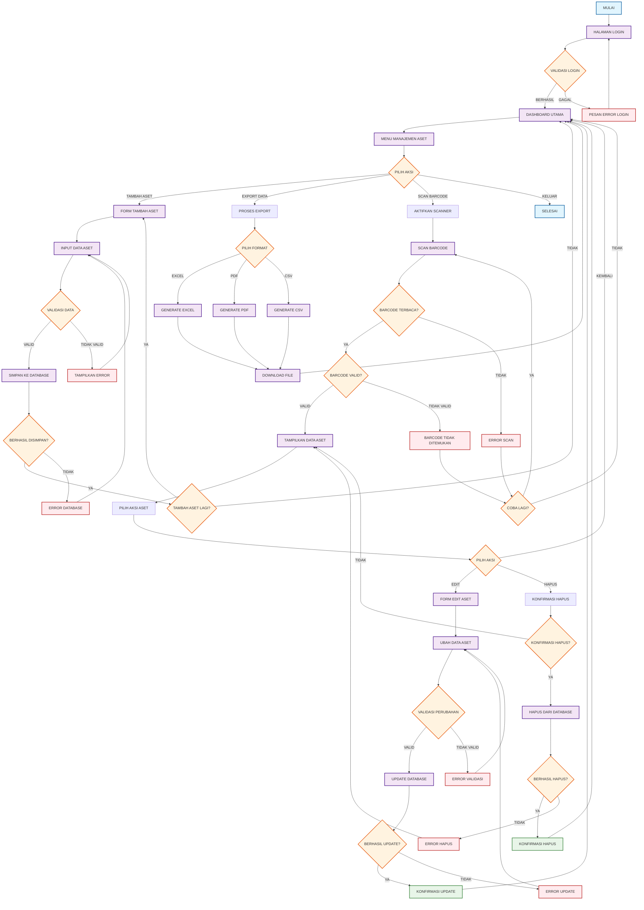

# Flowchart Asset Management System - Implementasi Mermaid

## Deskripsi
Implementasi flowchart Asset Management System yang telah diperbaiki menggunakan Mermaid syntax dengan terminologi Indonesia yang konsisten dan error handling yang lengkap.

## Flowchart Utama

## Penjelasan Alur Proses

### 1. Proses Login
- **Mulai**: Titik awal aplikasi
- **Halaman Login**: Form input username dan password
- **Validasi Login**: Pengecekan kredensial user
- **Error Handling**: Pesan error jika login gagal dengan redirect ke halaman login

### 2. Dashboard Utama
- **Dashboard Utama**: Halaman utama setelah login berhasil
- **Menu Manajemen Aset**: Navigasi ke berbagai fungsi sistem
- **Pilihan Aksi**: Menu utama dengan 4 opsi:
  - Tambah Aset
  - Export Data
  - Scan Barcode
  - Keluar

### 3. Tambah Aset
- **Form Tambah Aset**: Interface untuk input data aset baru
- **Input Data Aset**: Pengisian informasi aset
- **Validasi Data**: Pengecekan format dan kelengkapan data
- **Error Handling**: Pesan error jika validasi gagal
- **Simpan ke Database**: Proses penyimpanan data
- **Konfirmasi**: Opsi untuk menambah aset lagi atau kembali ke dashboard

### 4. Export Data
- **Proses Export**: Inisiasi ekspor data
- **Pilih Format**: Pemilihan format file (Excel, PDF, CSV)
- **Generate File**: Pembuatan file sesuai format yang dipilih
- **Download File**: Pengunduhan file hasil export

### 5. Scan Barcode
- **Aktifkan Scanner**: Mengaktifkan kamera untuk scanning
- **Scan Barcode**: Proses pembacaan barcode
- **Error Handling**: Penanganan error scan dan barcode tidak valid
- **Tampilkan Data Aset**: Menampilkan informasi aset yang terkait
- **Pilih Aksi Aset**: Opsi untuk edit atau hapus aset

### 6. Edit Aset
- **Form Edit Aset**: Interface untuk mengubah data aset
- **Validasi Perubahan**: Pengecekan data yang diubah
- **Update Database**: Proses pembaruan data
- **Error Handling**: Penanganan error validasi dan update

### 7. Hapus Aset
- **Konfirmasi Hapus**: Dialog konfirmasi sebelum penghapusan
- **Hapus dari Database**: Proses penghapusan data
- **Error Handling**: Penanganan error saat penghapusan

## Fitur Perbaikan

### 1. Terminologi Konsisten
- Semua teks menggunakan bahasa Indonesia
- Terminologi yang jelas dan mudah dipahami

### 2. Error Handling Lengkap
- Validasi login dengan pesan error
- Validasi data input dengan feedback
- Error handling untuk database operations
- Error handling untuk barcode scanning

### 3. Struktur yang Jelas
- Setiap proses memiliki alur yang terstruktur
- Decision points dengan semua kemungkinan output
- Loop dengan kondisi keluar yang jelas

### 4. Visual Styling
- Color coding untuk berbagai jenis proses
- Styling yang konsisten untuk readability
- Pengelompokan visual berdasarkan fungsi

## Cara Menggunakan

1. Copy kode Mermaid di atas
2. Paste ke dalam file markdown atau editor yang mendukung Mermaid
3. Flowchart akan ter-render otomatis di GitHub, GitLab, atau platform lain yang mendukung Mermaid

## Kustomisasi

Flowchart ini dapat dikustomisasi dengan:
- Mengubah warna styling sesuai brand
- Menambahkan proses baru sesuai kebutuhan
- Memodifikasi error handling sesuai implementasi
- Menambahkan logging dan audit trail